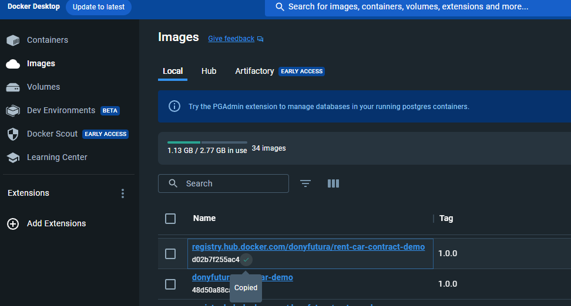

# rent-car-demo

## Contracts
### Для формирования и отправки образа в репозиторий необходимо:
* Запустить [bash скрипт](rent-car-contract/build_and_push_to_docker.sh) с параметром полного пути нахождения образа с названием и версией
Пример: `sh build_and_push_to_docker.sh registry.hub.docker.com/donyfutura/rent-car-contract-demo:1.0.0`
* После того, как контракт появился в репозитории необходимо получить его `imageHash`.
Сделать это можно спулив свой образ из репозитория через docker командой `docker pull donyfutura/rent-car-contract-demo:1.0.0`. После, в UI Docker из раздела Images взять хэш следующим образом:

* Полученный хэш необходимо будет вставить в сформированную транзакцию (103 tx CreateContractTx):
```json
{
    "image": "FULL_IMAGE_PATH_WITH_VERSION",
    "fee": 0,
    "imageHash": "IMAGE_HASH", // Полученный imageHash
    "type": 103,
    "params": [
        {
            "type": "string",
            "value": "initRent", // Название метода для создания контракта
            "key": "action"
        }
    ],
    "version": 2,
    "sender": "YOUR_SENDER_ADDRESS",
    "password": "YOUR_PASSWORD",
    "feeAssetId": null,
    "contractName": "rent-car-contract-demo"
}
```
* Сформированную транзакцию необходимо отправить в body в ноду по ендпоинту `POST http://NODE_ADDRESS/transactions/signAndBroadcast`
* После успешного подписания и отправки транзакции в ответ придет подписанная транзакция, которая имеет в себе поле `id`. Это поле = id созданного на ноде контракта. Пример ответной транзакции:
```json
{
    "senderPublicKey": "senderPublicKey",
    "image": "FULL_IMAGE_PATH_WITH_VERSION",
    "fee": 0,
    "imageHash": "IMAGE_HASH",
    "type": 103,
    "params": [
        {
            "type": "string",
            "value": "initRent", // Название метода 103-ей транзакции
            "key": "action"
        }
    ],
    "version": 2,
    "sender": "YOUR_SENDER_ADDRESS",
    "feeAssetId": null,
    "proofs": [
        "SIGNATURE"
    ],
    "contractName": "rent-car-contract-demo",
    "id": "2HFYWUanzRNsz5rsiBfddv1e45EjwDgphbt6xjuR5P7z", // Используем этот ид как ид контракта
    "timestamp": 1700223493547
}
```
* Для проверки создался ли контракт на ноде необходимо отправить в `POST http://NODE_ADDRESS/contracts` с телом:
```json
{
  "contracts": [
    "YOUR_CONTRACT_ID"
  ]
}
```
* В ответ придет тело со следующим содержимым. Так как метод initRent() ничего не меняет на стейте, по умолчанию в нем появилась только мета-информация необходимая для работы sdk:
```json
{
    "YOUR_CONTRACT_ID": [
        {
            "type": "string",
            "value": "{\"bytes\":\"EwVsiVs6R28KkhX+rmUX3rMMHErQ4TCEuBtX7Hsb3E0=\"}",
            "key": "__WRC12_CONTRACT_ID"
        },
        {
            "type": "string",
            "value": "{\"lang\":\"java\",\"interfaces\":[\"com.wavesenterprise.api.RentCarContract\"],\"impls\":[\"com.wavesenterprise.impl.RentCarContractImpl\"]}",
            "key": "__WRC12_CONTRACT_META"
        }
    ]
}
```
### Для вызова созданного контракта необходимо:
* Сформировать 104 транзакцию. Имеет следующий вид:
```json
{
    "contractId": "YOUR_CONTRACT_ID", // id контракта полученный в предыдущем этапе
    "fee": 0,
    "sender": "YOUR_SENDER_ADDRESS",
    "password": "YOUR_PASSWORD",
    "type": 104,
    "params":
    [
        {
           "type": "string",
           "key": "action",
           "value": "setRentContractCreator" // Название метода 104-ой транзакции
        },
        {
           "type": "string",
           "key": "rentContractCreator", // Название параметра
           "value": "SOME_ADDRESS" // Значение для параметра метода
        }
    ],
    "version": 2,
    "contractVersion": 1
}
```
* Отправить сформированную транзакцию в теле по ендпоинту `POST http://NODE_ADDRESS/transactions/signAndBroadcast`
* После успешного майнинга транзакции состояние(state) контракта должен был измениться и при вызове `POST http://NODE_ADDRESS/contracts` с телом:
```json
{
  "contracts": [
    "YOUR_CONTRACT_ID"
  ]
}
```
Мы должны получить подобный ответ:
```json
{
    "2HFYWUanzRNsz5rsiBfddv1e45EjwDgphbt6xjuR5P7z": [
        {
            "type": "string",
            "value": "{\"bytes\":\"EwVsiVs6R28KkhX+rmUX3rMMHErQ4TCEuBtX7Hsb3E0=\"}",
            "key": "__WRC12_CONTRACT_ID"
        },
        {
            "type": "string",
            "value": "{\"lang\":\"java\",\"interfaces\":[\"com.wavesenterprise.api.RentCarContract\"],\"impls\":[\"com.wavesenterprise.impl.RentCarContractImpl\"]}",
            "key": "__WRC12_CONTRACT_META"
        },
        {
            "type": "string",
            "value": "SOME_ADDRESS", // Значение отправленное параметром в последней транзакции
            "key": "CONTRACT_CREATOR"
        }
    ]
}
```